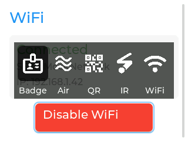
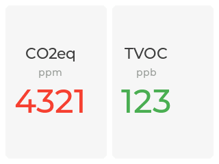

# Display Firmware

ESPHome firmware for the HOPE Badge display. Built on [LVGL](https://lvgl.io/) and targeting the ESP32-C3 with a 320×240 ST7789V display.

## UI Overview

The UI has four pages selectable via a page switcher overlay. Navigation uses the physical buttons on the badge.

### Controls

| Button | Action |
|--------|--------|
| Button 1 (hold) | Open page switcher |
| Button 1 (release) | Confirm selection and dismiss switcher |
| Button 2 / 3 | Previous / Next item within a page |
| Button 4 | Select / activate focused item |

### Page Switcher

Hold Button 1 to open the page switcher overlay, then use Button 2/3 to navigate between pages. Release Button 1 to confirm.



### Pages

#### Badge
Displays the badge owner's name and subtitle. Configurable via the web server.


#### Air Quality
Shows live CO₂eq (ppm) and TVOC (ppb) sensor readings from the onboard air quality sensor.



#### QR Code
Displays a configurable QR code. Supports URLs, contact cards (MECARD), Wi-Fi credentials, and more. Configurable via the web server.


#### IR Blast
Sends an IR blast command (NEC protocol, address `0xD880`, command `0xDD22`) to nearby badges. Receiving badges flash their LEDs and vibrate.


## Adding a New Page

To add a page, touch **3 places**:

### 1. Create `apps/page_yourpage.yaml`

Define the page content by extending `badge_lvgl`. For pages with interactive widgets (buttons), create a focus group in `on_boot` and register it via `lv_obj_set_user_data`:

```yaml
lvgl:
  - id: !extend badge_lvgl
    pages:
      - id: page_yourpage
        on_boot:                          # only needed if the page has interactive widgets
          - lambda: |-
              lv_group_t* group = lv_group_create();
              lv_obj_set_user_data(id(page_yourpage).obj, group);
              lv_group_add_obj(group, id(your_button));
        styles: [page, surface]
        widgets:
          # ... your widgets here
```

Pages with no interactive widgets (labels only) don't need `on_boot` at all.

### 2. Edit `lvgl.yaml`

Add the package include and the icon glyph (find glyph codepoints at [fonts.google.com/icons](https://fonts.google.com/icons)):

```yaml
packages:
  yourpage: !include ./apps/page_yourpage.yaml   # add this

font:
  - file: "./MaterialSymbolsRounded.ttf"
    id: icons_40
    glyphs:
      - "\U000XXXXX"   # add your icon glyph here
```

### 3. Edit `page_selector.yaml`

Add the selector entry widget and register the page in `on_boot`:

```yaml
# In on_boot, add one line (in page order matching lvgl.yaml packages):
register_page(group, id(page_yourpage).obj, id(sel_btn_yourpage));

# In widgets, add a new entry block:
- obj:
    styles: [container, switcher_entry]
    layout:
      type: FLEX
      flex_flow: COLUMN
      flex_align_cross: CENTER
    widgets:
      - button:
          id: sel_btn_yourpage
          scroll_on_focus: true
          styles: [switcher_button]
          focus_key:
            styles: [switcher_focused]
          widgets:
            - label:
                text: "\U000XXXXX"   # same icon glyph
      - label:
          text: YourPage
```

The `show_selector` and `dismiss_selector` scripts in `lvgl.yaml` require **no changes**.

## Configuration

Badge content (title, subtitle, QR code text) is configurable via the built-in web server at the badge's local IP address.

To set Wi-Fi credentials on a new device, use [Improv via Serial](https://www.improv-wifi.com/) or connect to the fallback access point.

## Files

| File | Description |
|------|-------------|
| `main.yaml` | Main firmware config (hardware + Wi-Fi + web server) |
| `main_dev.yaml` | Development variant |
| `main_host.yaml` | Host/SDL build for desktop simulation |
| `lvgl.yaml` | LVGL config, styles, page switcher logic |
| `page_selector.yaml` | Page switcher overlay widget |
| `menu.h` | C++ helpers for LVGL group/input management |
| `apps/` | Individual page definitions |

## Building

### Hardware (ESP32-C3)

```bash
esphome run main.yaml
```

### Host/SDL Simulator (desktop)

Build and run the firmware locally for UI development without hardware:

```bash
esphome run main_host.yaml
```

This opens a 320×240 SDL window. Keyboard keys are mapped to badge buttons:

| Key | Badge button |
|-----|-------------|
| `m` | Button 1 (menu) |
| `,` | Button 2 (prev) |
| `.` | Button 3 (next) |
| `/` | Button 4 (enter) |

**Prerequisites:** SDL2 (`libsdl2-dev`) and ESPHome with host platform support.

## Taking Screenshots

Run the simulator and press `s` to automatically capture all pages:

```bash
cd firmware_display
esphome compile main_host.yaml
.esphome/build/sdl/.pioenvs/sdl/program
# Press s in the SDL window
```

This cycles through every page, saves each as a BMP in `screenshots/`, then returns to the current page. Convert to PNG with one of the following:

**On macOS (using `sips`):**

```bash
for f in screenshots/*.bmp; do sips -s format png "$f" --out "${f%.bmp}.png"; rm "$f"; done
```

**On Linux or other platforms (using ImageMagick `convert`):**

```bash
for f in screenshots/*.bmp; do convert "$f" "${f%.bmp}.png" && rm "$f"; done
```

The mock values shown in the simulator are set in `main_host.yaml` under `on_boot`.
